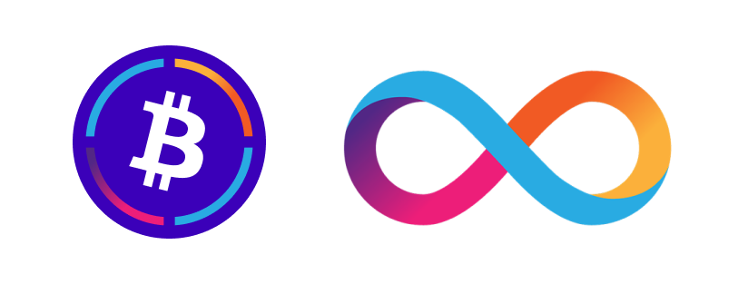

# IC-POS

The Internet Computer [integrates directly with the Bitcoin network](https://internetcomputer.org/docs/current/developer-docs/integrations/bitcoin/). This allows canisters on the Internet Computer to receive, hold, and send Bitcoin, all directly with transactions on the Bitcoin network. Chain-key Bitcoin (ckBTC) is an ICRC-1-compliant token that is backed 1:1 by Bitcoin held 100% on the IC mainnet. IC-POS is an experimental app to demonstrate a real world use case for ckBTC on the Internet Computer. It is a simple Point of Sale app that allows users to accept ckBTC payments.

For deeper understanding of the ICP < > BTC integration, see the IC wiki article on [Bitcoin integration](https://wiki.internetcomputer.org/wiki/Bitcoin_Integration).

## Features

- Users can login with their Internet Identity and configure a store.
- Display a QR code for customers to scan and pay. When a payment is received, the app will display a confirmation message.
- Payment notificactions as email/sms even when the app is not open. This uses the [HTTP Outcall](https://internetcomputer.org/docs/current/developer-docs/integrations/https-outcalls/) feature of the Internet Computer.
- Send ckBTC to other users.

## Try it!

EzPOS is deployed on the Internet Computer. You can try it out here:

https://hngac-6aaaa-aaaal-qb6tq-cai.icp0.io/

https://github.com/kristoferlund/ic-pos/assets/9698363/f67d9952-3ee1-4876-a5e5-6ed0e29bae9d

## Architecture

### Backend

The backend is written in Motoko and consist of one canister, `icpos`. It exposes four public methods:

- `getMerchant` - returns the store configuration for a given principal.
- `updateMerchant` - updates the store configuration for a given principal.
- `getLogs` - The canister maintains a debug log that can be fetched using this method.
- `setCourierApiKey` - sets the Courier API key used to send email and SMS notifications. Only the canister controller can call this method.

In addition to the public methods, the canister uses a [timer](https://internetcomputer.org/docs/current/motoko/main/timers/) to monitor ledger transactions. When a new transaction is found that matches a configured store – depending on the store settings – the canister will send a notification either by email or SMS.

### Frontend

The frontend is written in Typescript/Vite/React/TailwindCSS. Users authenticate using the Internet Identity to access their store. The first time a user logs in, a store is created for them.

The frontend interacts with the following IC canisters:

- `icpos` - to fetch and update store configuration.
- `ckbtc ledger` - to send ckBTC to other users.
- `internet identity` - to authenticate users.

## Prerequisites

- [x] Install the [IC SDK](https://internetcomputer.org/docs/current/developer-docs/setup/install/index.mdx).

### Step 1: Start a local instance of the Internet Computer

```
dfx start --background
```

### Step 2: Deploy the icpos canister:

```
dfx deploy icpos --argument '(0)'
```

The `--argument '(0)'` argument is used to initialize the canister with `startBlock` set to 0. This is used to tell the canister to start monitoring the ledger from block 0. When deploying to the IC mainnet, this should be set to the current block height to prevent the canister from processing old transactions.

### Step 3: Set Courier credentials

IC-POS uses [Courier](https://courier.com/) to send email and SMS notifications. You need to configure your Courier credentials in the `icpos` canister. You can do this by running the following command:

```
dfx canister --network local call icpos setCourierApiKey "pk_prod_..."
```

### Step 4: Build and run the frontend

```
yarn
yarn dev
```

The frontend is best run locally using yarn. Accessing the frontend through the local canister does not work at the moment due to lazy loading of modules. When deploying to ic mainnet this is not an issue.

## Not yet implemented

- **Email notifications and SMS notifications are not yet fully functional.** Notifications work well in a local setting but not when deployed to the IC mainnet. This is due to the inability to call IPv4 addresses from the IC mainnet. As of writing, Courier does not support IPv6, nor have I found any other service that does.

## Notes

- Make sure you update the frontend environment variables in `src/.env` to match your local setup. Also update `vite.config.ts` to set the frontend canister id.
- The ICRC ledger address is hardcoded in `src/icpos/main.mo`. Make sure you update this before deploying.
- I included the generated files in `src/declarations` to highlight the changes I made to the generated code. Vite does not support `process.env` so I had to manually replace it with `import.meta.env`.

## Possible Improvements

- Use `useCkBtcLedger` hook to fetch transactions instead of the ICRC API for logged in users.
- Login state is not persisted. Reloading the app will log the user out. This should be done using `localStorage` or `sessionStorage`.
- Show more information about transactions. A transaction detail page.
- Show a confirmation dialog after user clicks on `Send` button.

## Known issues

- Background notifications not working. Awaiting IC IPv4 support.

## Contributing

Contributions are welcome! Please open an issue or submit a pull request.

## Author

- [kristofer@fmckl.se](mailto:kristofer@fmckl.se)
- Twitter: [@kristoferlund](https://twitter.com/kristoferlund)
- Discord: kristoferkristofer

## License

[MIT](LICENSE)
